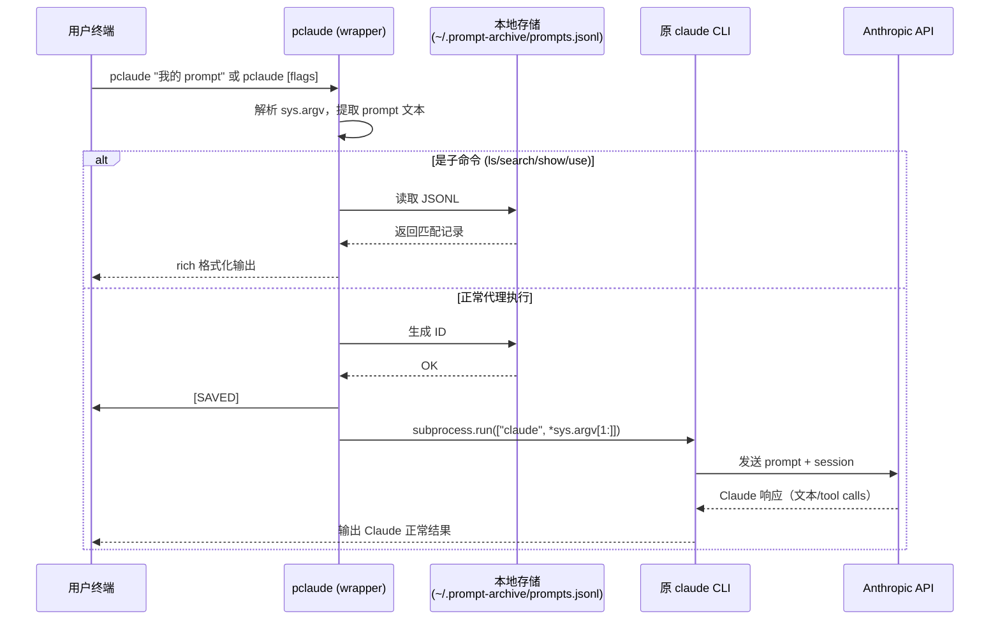

# 产品需求文档（PRD）  
**产品名称**：pclaude（Prompt-Claude）  
**版本**：1.0 – MVP  
**文档状态**：已锁定、可进入开发  
**创建 / 锁定日期**：2026年2月8日  
**产品负责人**：Sam Lam  
**协作设计**：Grok（首席产品设计师角色）

## 1. 核心目标（Mission）

让每一次向 Claude Code CLI 精心构造的 prompt 成为用户永久拥有的、可搜索、可复用、可不断进化的个人思考资产，  
通过“提问复利”显著提升开发者、产品人、独立创业者在 AI 辅助编码与业务决策中的长期效率与能力。

**一句话总结**：  
“把你问 AI 的每一个好问题，变成你自己的长期资产。”

## 2. 目标用户与核心痛点

**主要用户**：重度 Claude Code CLI 用户（终端交互式 AI 编码代理工具）  
**典型角色**：独立开发者、独立 hacker、产品经理、技术型创业者、Amazon FBA / 副业运营者  
**核心痛点**：
- 精心设计的长 prompt 用完即丢，无法积累
- Claude Code 只保存混杂的 session JSONL，没有独立、可搜索的“纯 prompt”库
- 相同或相似问题反复重新构思，经验流失严重
- 缺乏零摩擦、CLI 原生的 prompt 捕获与复用方案

## 3. MVP 核心价值主张

**一句话**：  
每次运行 `pclaude` 代替 `claude` 时，自动、透明、无感地保存完整用户 prompt，并提供最轻量的浏览、搜索、复用能力。

**用户感知**：  
“我敲的每一个 prompt 都被悄悄存起来了，而且找回来超级简单。”

## 4. MVP 功能范围（必须交付）

| 优先级 | 功能                              | 描述                                                                                   | 验收标准                                                                 |
|--------|-----------------------------------|----------------------------------------------------------------------------------------|--------------------------------------------------------------------------|
| P0     | CLI wrapper                       | 支持所有原 `claude` 命令行参数透传                                                     | 可完整运行 `-p`、交互模式、`--resume`、`--project` 等所有常见用法        |
| P0     | 自动捕获 & 保存 prompt            | 捕获用户输入的完整 prompt，保存到本地 JSONL                                           | prompt 文本 100% 完整；带时间戳、自增 ID                                 |
| P0     | 轻量保存反馈                      | 保存后输出 1 行绿色提示：[SAVED] #123 (时间) + 复用建议                               | 不阻塞原输出；支持 --quiet 关闭                                          |
| P0     | 子命令：ls / list                 | 显示最近 N 条（默认 10），格式：ID + 时间 + prompt 前缀                                | 支持 --recent N、--all                                                   |
| P0     | 子命令：search <关键词>           | 全文模糊搜索 prompt，返回匹配列表                                                     | 至少显示前 3 条完整 prompt                                               |
| P0     | 子命令：show <id>                 | 显示单条完整 prompt                                                                    | 可直接复制                                                               |
| P0     | 子命令：use <id> ["追加指令"]     | 复用历史 prompt，可追加新内容后重新执行                                               | 复用后仍自动保存为新记录                                                 |
| P1     | 存储路径配置                      | 默认 ~/.prompt-archive/prompts.jsonl，可通过环境变量 PROMPT_ARCHIVE_DIR 修改          | —                                                                        |
| P1     | --quiet / --no-save 选项          | 临时关闭保存或反馈                                                                     | —                                                                        |

## 5. 非功能需求

- **隐私**：纯本地，无任何网络请求、无 telemetry
- **性能**：保存操作 < 10ms，不影响 claude 响应速度
- **兼容性**：Python 3.11+，Claude Code CLI 最新版（2026年2月基准）
- **安装**：pipx install pclaude（推荐）或 pip install pclaude
- **依赖**：仅 typer + rich

## 6. 数据结构（Data Contract）

存储格式：JSON Lines（每行一条记录）

```json
{
  "id": "#123",
  "timestamp": "2026-02-08T08:45:12.345+09:00",
  "prompt": "完整用户输入文本（不截断、不清洗）",
  "source": "one-shot",
  "session_id": null
}
```

- id：自增整数 + # 前缀（从 1 开始）
- timestamp：ISO 8601 带毫秒与时区
- source：one-shot（-p 模式）或 repl（交互模式，MVP 先仅支持 one-shot）

## 7. 交互风格（已锁定：轻量反馈型）

保存成功时输出示例：

```
[SAVED] Prompt archived as #123 (2026-02-08 08:45 JST)
Use: pclaude use 123    or    pclaude show 123
```

子命令示例（使用 rich 表格）：

```
$ pclaude ls --recent 3
#124  08:50  make it async with aiohttp...
#123  08:45  Write a Python script to scrape Amazon...
#122  07:30  Analyze my FBA ad spend last week...
```

## 8. 核心流程图（Mermaid）



## 9. 组件交互说明（模块划分与调用关系）

```
pclaude/                        # 项目根
├── src/
│   └── pclaude/
│       ├── __init__.py
│       ├── __main__.py         # 入口：判断是子命令还是代理模式
│       ├── cli.py              # typer App + 子命令定义 (ls, search, show, use)
│       ├── capture.py          # 核心：提取 prompt → 生成记录 → 保存 → 反馈
│       ├── storage.py          # JSONL 读写：append_prompt(), get_next_id(), read_all()
│       └── utils.py            # 辅助：颜色、时间格式、prompt 提取逻辑
├── pyproject.toml
├── README.md
└── .gitignore
```

**关键调用关系**：

- `__main__.py` → 判断 sys.argv[1] 是否为子命令 → 分发到 `cli.py` 或 `capture.py`
- `capture.py` → `storage.py` (append_prompt + get_next_id)
- `capture.py` → `utils.py` (get_prompt_text)
- `capture.py` → subprocess.run(["claude", *args]) 转发
- `cli.py` → `storage.py` (read_all / search)

## 10. 技术选型（完全锁定）

| 类别           | 选型                  | 理由简述                              |
|----------------|-----------------------|---------------------------------------|
| 语言           | Python 3.11+          | 生态成熟、CLI 开发效率高              |
| CLI 框架       | typer                 | 类型提示友好、自动 --help 优秀        |
| 参数透传       | subprocess.run        | 最可靠的外部命令调用方式              |
| 存储           | JSON Lines (.jsonl)   | 极简、无依赖、append-only 天然安全    |
| 控制台美化     | rich                  | 颜色 + 表格输出，现代感强             |
| ID 生成        | 文件内自增整数        | 简单、可读（#1, #2, ...）             |
| 打包           | poetry + PyPI         | 标准现代 Python 打包流程              |
| 推荐安装方式   | pipx                  | 隔离环境、全局可用                    |

**最小依赖列表**（pyproject.toml）：

```toml
[tool.poetry.dependencies]
python = "^3.11"
typer = "^0.12"
rich = "^13"
```

## 11. 潜在技术风险与缓解措施

| 风险序号 | 风险描述                                      | 严重性 | 缓解措施                                                                 |
|----------|-----------------------------------------------|--------|--------------------------------------------------------------------------|
| R1       | 参数透传不完整（复杂 flag / 交互模式）        | 高     | 全面测试常见组合（-p, --resume, --project, --init）；使用 shell=False   |
| R2       | 交互式 REPL 模式下多轮 prompt 捕获困难        | 中     | MVP 先仅支持 -p one-shot 模式；V1.1 再用 pty 或 input 钩子支持 REPL     |
| R3       | JSONL 文件并发写损坏（极罕见多进程同时运行）  | 低     | 使用文件锁（flock）或 atomic append（Python 默认安全）；文档说明单用户 |
| R4       | Claude CLI 未来版本行为变更                   | 中     | 只依赖 subprocess 调用，不解析内部输出；定期手动验证兼容性              |
| R5       | 存储文件过大（>10万条）搜索变慢               | 低     | MVP 不优化；V2 可引入 tiny SQLite 索引或分文件存储                      |

## 12. 后续版本规划（非 MVP）

- **1.1**：交互 REPL 支持、--quiet 全局配置、基础自动标签
- **1.2**：prompt 模板、批量导出 Markdown、tags & 备注
- **2.0**：prompt 版本对比、edit / fork、增强搜索
- **3.0**：跨工具支持（grok-cli 等）、相似 prompt 智能推荐

## 13. 成功指标（MVP 验证）

- 7 天留存：安装后 7 天内至少运行 5 次的用户占比
- 平均 prompt 保存量 / 活跃用户 / 周
- 子命令使用率（尤其是 use / search）
- 用户反馈关键词：积累、复用、找回、资产

---

**文档锁定声明**  
本 PRD 于 2026 年 2 月 8 日由 Sam Lam 确认锁定，可作为开发、测试、发布依据。  
任何重大范围变更需重新评审并更新版本号。

电子确认：Sam Lam  
日期：2026-02-08
```
